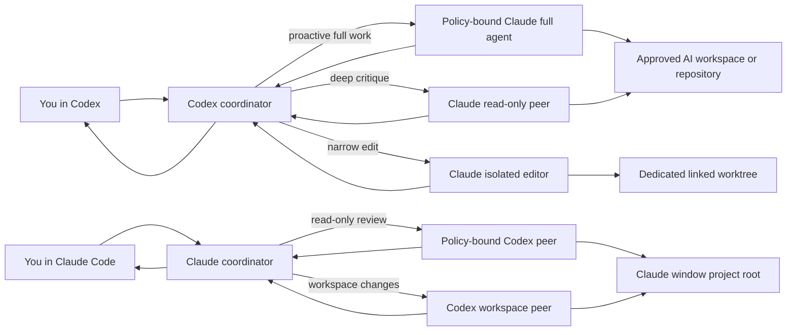

# Codex + Claude Duo

This bundle provides a bidirectional local collaboration bridge. Codex can bring a locally authenticated Claude Code agent into its task, and an interactive Claude Code window can independently invoke a locally authenticated Codex peer through Codex's official MCP server. Either host may invoke the other proactively when an independent implementation or review pass materially helps; a separate “ask the other agent” request is not required.

The Codex-to-Claude direction has two deliberately different collaboration surfaces:

- **Full built-in Claude agent:** Claude can inspect and edit files, run commands and tests, and use its built-in web tools in an approved workspace. This is the normal choice for user-authorized build, change, debugging, and verification work.
- **Hardened peer modes:** read-only multi-round review and a one-use, path-scoped Git-worktree editor remain available when the narrower boundary is preferable.

The default workspace is exactly:

```text
C:\Users\gui07\Desktop\‎\Notes\AI
```

The visually blank directory between `Desktop` and `Notes` is one `U+200E LEFT-TO-RIGHT MARK`. Both the launcher and MCP server construct it from the code point, so it is not lost during copy/paste. The launcher recreates the final `AI` directory if it is absent and always adds it to Claude's approved workspace roots.

## What “full Claude” means

The full phase starts the native Claude Code CLI with:

- `--tools default`, which enables all built-in Claude Code tools;
- `--permission-mode auto`, which lets Claude work autonomously without routine permission prompts while retaining Anthropic's background safety classifier;
- file editing, shell execution, tests, Claude subagents, WebSearch, and WebFetch;
- persistent opaque sessions that Codex can continue with follow-up instructions;
- visible rolling aliases and exact model presets, with Fable-first ordered fallback and per-call model evidence;
- selectable reasoning/workflow settings with deepest reasoning (`max`) as the default;
- Max-subscription OAuth, not an Anthropic API key.

It is “full built-in Claude Code,” not a byte-for-byte relay of the interactive terminal UI. Headless `claude -p` does not expose interactive slash-command menus or permission dialogs, and this bridge intentionally disables user/project Claude settings, custom hooks, custom MCP servers, Chrome integration, and recursive Claude/Codex launches. Those exclusions keep the two-agent bridge reproducible and prevent an unreviewed local configuration from silently changing what runs.

Native Windows does not provide Claude Code's Linux command sandbox. The full phase can make real changes anywhere its shell credentials and OS account can reach; the workspace-root check is an orchestration boundary, not an operating-system sandbox. Use the isolated implementation phase for stronger path accounting, or run the full agent inside a VM/WSL/container if an OS boundary is required.

## Architecture



Codex remains the coordinator: it owns the user's scope, decides what evidence to reconcile, checks both agents' work, and gives the final answer. Claude output and repository text remain untrusted task material; neither can expand authorization to commit, push, deploy, make purchases, send messages, or contact third parties.

When Claude Code is the interactive host, the relationship mirrors cleanly: Claude owns the user-facing scope and final reconciliation, while Codex acts as the independent peer. The invoked peer is never allowed to call back into the host. Codex-launched Claude has strict empty MCP/settings sources; Claude-launched Codex starts with plugins, apps, hooks, and configured MCP servers disabled. This prevents Codex -> Claude -> Codex and Claude -> Codex -> Claude recursion in both directions.

## One-time setup

Run these commands from a normal PowerShell window.

### 1. Inspect the current state

```powershell
$bundle = 'C:\Users\gui07\codex-claude-duo'
powershell -ExecutionPolicy Bypass -File (Join-Path $bundle 'setup.ps1')
```

The doctor is read-only. It reports the native Claude CLI, standalone Codex CLI, Max/ChatGPT login status, Node runtime, billing-route conflicts, bundle path, and exact default AI workspace without printing tokens or account identifiers.

### 2. Install missing native CLIs

```powershell
powershell -ExecutionPolicy Bypass -File (Join-Path $bundle 'setup.ps1') -InstallCLIs
```

Equivalent official installs are:

```powershell
winget install Anthropic.ClaudeCode
winget install OpenAI.Codex
```

Open a new PowerShell window after an install so WinGet links and PATH are refreshed.

### 3. Authenticate Claude with Max 20x

```powershell
powershell -ExecutionPolicy Bypass -File (Join-Path $bundle 'setup.ps1') -LoginClaude
```

Complete the browser login with the Claude account that owns Max 20x. The bridge requires `claude auth status --json` to report recognized first-party Max OAuth. It refuses known API-key, Bedrock, Vertex, Foundry, and custom-base-URL routes.

For Codex, run `codex login` and choose ChatGPT authentication if `codex login status` does not already report it.

### 4. Install or refresh the plugin

```powershell
powershell -ExecutionPolicy Bypass -File (Join-Path $bundle 'setup.ps1') -InstallCodexPlugin
```

The setup script verifies that the configured local marketplace named `codex-claude-duo-local` points to this reviewed bundle before reinstalling. Start a **new Codex task/process** afterward; an already-running MCP process cannot hot-load a new tool schema or skill.

### 5. Install the reciprocal Claude Code plugin

```powershell
powershell -ExecutionPolicy Bypass -File (Join-Path $bundle 'setup.ps1') -InstallClaudePlugin
```

This registers the bundle's local `codex-claude-duo` marketplace with Claude Code at user scope and installs `codex-peer@codex-claude-duo`. User scope is intentional: the reciprocal Codex peer is available in every new Claude Code project window, but each MCP process binds itself permanently to that window's `CLAUDE_PROJECT_DIR`. Start a **new Claude Code window/process** afterward so its plugin, skill, and MCP server load.

To refresh both directions after changing the bundle:

```powershell
powershell -ExecutionPolicy Bypass -File (Join-Path $bundle 'setup.ps1') `
  -InstallCodexPlugin -InstallClaudePlugin
```

## Launching in the default AI workspace

No repository argument is needed:

```powershell
powershell -ExecutionPolicy Bypass -File (Join-Path $bundle 'start-duo.ps1')
```

The launcher safely constructs the path as:

```powershell
$aiRoot = [IO.Path]::Combine($env:USERPROFILE, 'Desktop', [string][char]0x200E, 'Notes', 'AI')
```

It creates the exact directory if needed, verifies saved ChatGPT authentication, refuses Codex API-routing environment variables, sets `CLAUDE_PEER_ALLOWED_ROOTS` only for the launched process tree, and starts Codex in that workspace. Non-Git directories are supported by `claude_full`.

Hosted Codex connector Apps remain enabled by default. To avoid leaving the terminal in a known-degraded state when the built-in `codex_apps` client's fixed 30-second `tools/list` timeout fires, the launcher uses a supervised local App Server:

1. it creates the actual empty Codex terminal thread without starting a model turn;
2. it waits for that exact thread's authoritative `codex_apps = ready` and `claude-peer = ready` events;
3. it keeps that thread and its WebSocket connection loaded while the terminal attaches;
4. it opens the terminal on the same already-live thread instead of starting a second Apps connection.

The launcher deliberately does not use `app/installed {forceRefresh:true}` or repeated `mcpServerStatus/list` calls as readiness gates. In Codex 0.147.0 those calls create separate temporary Apps runtimes with the same fixed 30-second timeout. They can fail—or merely show cached catalog data—without proving the actual terminal thread is ready. Only that thread's live startup event is accepted.

The empty thread is materialized with an empty internal assistant item so it can be resumed without inventing a user message, title, model turn, or Git metadata. While the terminal is attached, the supervisor remains a passive subscriber: it never answers approval, user-input, or MCP-elicitation requests, leaving those decisions to the visible Codex TUI.

If the hosted service is temporarily unavailable, the launcher terminates only its failed App Server process tree and retries. The default `-AppsRetryLimit 0` means retry until Apps is ready or you press Ctrl+C, so it does not silently start a connector-free or known-degraded terminal. Set a finite bound when desired:

```powershell
powershell -ExecutionPolicy Bypass -File (Join-Path $bundle 'start-duo.ps1') `
  -AppsRetryLimit 3 `
  -AppsAttemptTimeoutSeconds 120
```

Codex currently labels App Server WebSocket/remote-TUI transport experimental. Resilient mode therefore requires an interactive terminal and fails before creating a task when stdin/stdout/stderr are not TTYs. `-DirectCodex` is the conservative or non-interactive fallback: it launches the ordinary TUI with Apps still enabled but cannot guarantee that a transient 30-second hosted-service stall will recover before the startup banner. `-DisableApps` exists only as an explicit opt-out. The old `-EnableApps` switch remains accepted for command compatibility but is no longer necessary.

Resilient mode applies ordinary config, feature-toggle, model, sandbox, approval, additional-root, and `--search` choices before it creates the live thread. Prefer the long Codex forms (`--config`, `--model`, `--sandbox`, and `--ask-for-approval`) because they pass naturally through Windows PowerShell. Before a short Codex option that PowerShell can interpret as a launcher/common parameter (`-c`, `-a`, `-p`, `-V`, or `-C`), insert PowerShell's parameter terminator:

```powershell
powershell -ExecutionPolicy Bypass -File (Join-Path $bundle 'start-duo.ps1') -- `
  -c 'model_reasoning_effort="high"' -a never
```

PowerShell removes that first `--`. If the Codex prompt itself needs Codex's own `--` delimiter, pass two delimiters: the first belongs to PowerShell and the second is forwarded to Codex. Options that fundamentally select a different CLI host (`--profile`, `--oss`, `--local-provider`, a second `--remote`, or hook-trust bypass) fail clearly instead of being silently ignored by resume; use `-DirectCodex` for those specialized invocations.

To launch in another repository or directory while keeping the AI workspace available:

```powershell
$work = 'C:\path\to\project'
powershell -ExecutionPolicy Bypass -File (Join-Path $bundle 'start-duo.ps1') -Workspace $work
```

`-Repository` remains an alias for `-Workspace`. Add other specific roots with `-AdditionalAllowedRoot`. While the restriction is on, drive roots and the entire user profile are refused.

The MCP server also includes the exact AI workspace as a built-in fallback root when it already exists. That makes the default usable from Codex Desktop, where a launcher-created process environment is not always available.

## Claude workspace root policy

The workspace-root restriction is a persistent operator setting, not a per-process one. It lives in a small JSON file in the default AI workspace:

```
C:\Users\gui07\Desktop\‎\Notes\AI\claude-peer-config.json
```

```json
{
  "allowAllRoots": true,
  "allowedRoots": []
}
```

`allowAllRoots: true` removes the root restriction entirely: `claude_plan`, `claude_full`, and `claude_implement` accept any existing directory as `cwd`. `allowedRoots` adds extra permanent roots that are used only while the restriction is on; entries that do not exist are ignored and reported by `claude_status` as `ignoredMissingConfigRoots`.

The file is stored outside the plugin cache and is re-read on every bridge call. It therefore survives Codex restarts, brand-new conversations, and plugin reinstalls, and an edit takes effect for the next call without relaunching anything. A file that is present but not valid JSON — or that has the wrong types — fails loud on every call instead of silently reverting to a policy the operator did not choose.

Set it from the launcher instead of editing by hand:

```powershell
powershell -ExecutionPolicy Bypass -File (Join-Path $bundle 'start-duo.ps1') -AllowAllRoots
powershell -ExecutionPolicy Bypass -File (Join-Path $bundle 'start-duo.ps1') -RestrictRoots
```

Each switch rewrites `allowAllRoots` in the file, preserves the other keys, and pins the matching process-level override for that launcher's children. Without a switch the launcher leaves the file authoritative and clears any inherited override. The two switches cannot be combined.

Resolution order, highest first:

1. `CLAUDE_PEER_ALLOW_ALL_ROOTS` — an explicit per-process decision in either direction (`1/true/yes/on/all/*` or `0/false/no/off`; an empty value is no decision, and anything else fails loud);
2. a `*` entry inside `CLAUDE_PEER_ALLOWED_ROOTS`;
3. `allowAllRoots` in the persistent file;
4. the built-in default, which is the restricted allowlist.

`CLAUDE_PEER_CONFIG` points the bridge at a different policy file, which is what the automated tests use so the machine's real policy cannot leak into them.

Removing the root restriction changes filesystem scope and nothing else. Still enforced in both modes: first-party Claude Max OAuth verification, billing/provider environment-variable refusal, sensitive-path Read/Edit/Write denials, `claude_implement` one-use worktree authorization and audit, and secret redaction of returned content. `claude_status` reports the effective mode, who decided it, the file path, whether the file exists, and that same list under `rootPolicy`; `tools/list` and `initialize` describe the `cwd` contract that is actually enforced rather than a stale allowlist claim.

Removing the restriction is a real widening: `claude_full` runs shell commands, and a name-based filter is not an operating-system sandbox. Prefer `allowedRoots` when a fixed set of directories is enough.

## Proactive invocation

The skill declares `allow_implicit_invocation: true`, its trigger no longer requires an explicit Claude request, and MCP initialization tells Codex that Claude may be used whenever it materially improves an in-scope task. This removes the previous model-policy gate.

A plugin cannot force every future Codex model turn to call a tool regardless of context, availability, or user scope. What it can do—and now does—is make Claude callable at Codex's discretion, recommend proactive use for substantive work, and remove the “user must explicitly request Claude” restriction. Every call still consumes Claude allowance and can fail if the CLI is logged out or Anthropic limits are reached.

### Quick side questions without interrupting Claude

When Claude is already running a long inference, use Codex's `/btw` command for a quick side question. Codex handles that aside without steering, cancelling, or replacing the active task, then continues waiting for Claude and reconciles the original result when it finishes. The plugin skill and MCP initialization instructions both preserve this behavior and may remind the user about `/btw` when an unrelated aside would otherwise interrupt ongoing Claude work.

`/btw` belongs to the Codex terminal client rather than this plugin, so it must be available in the installed Codex version. An explicit request to stop or replace the current task still takes precedence.

## MCP tools

The plugin exposes eight tools:

| Tool | Capability | Default conversation budget |
|---|---|---:|
| `claude_full` | Full built-in tools, direct workspace writes, commands, tests, web tools | Initial response + 6 continuations |
| `claude_full_reply` | Continue the same full session | Counts against the bounded session, or uncapped for an explicit unlimited session |
| `claude_full_unlimited` | Full built-in tools with no bridge reply ceiling | Explicit consent required |
| `claude_plan` | Read-only deep review with Read/Glob | Initial response + 6 continuations |
| `claude_reply` | Continue a read-only review | Counts against bounded session, or uncapped for an explicit unlimited session |
| `claude_plan_unlimited` | Read-only review with no bridge reply ceiling | Explicit consent required |
| `claude_implement` | One-use, path-scoped edits in a clean linked worktree; no shell | One implementation call |
| `claude_status` | Read-only CLI/auth/root/policy diagnostic | No inference |

All session continuation tools use an opaque bridge handle and a monotonically increasing `expectedReplyNumber`. A stale retry is rejected before inference, and a failed, timed-out, cancelled, or identity-mismatched continuation closes the handle rather than risking a forked conversation.

## Claude Code -> Codex reciprocal peer

The Claude Code plugin lives under `claude-plugins/codex-peer` and wraps the official experimental `codex mcp-server` rather than reimplementing Codex's thread protocol. Its policy proxy exposes seven Claude-side tools:

| Tool | Capability | Default conversation budget |
|---|---|---:|
| `codex_plan` | Read-only independent Codex review | Initial response + 6 continuations |
| `codex_reply` | Continue the matching read-only session | Counts against the bounded session, or uncapped for explicit unlimited mode |
| `codex_plan_unlimited` | Read-only session with no numerical reply cap | Explicit consent required |
| `codex_full` | Workspace-write Codex agent with network disabled | Initial response + 6 continuations |
| `codex_full_reply` | Continue the matching workspace-write session | Counts against the bounded session, or uncapped for explicit unlimited mode |
| `codex_full_unlimited` | Workspace-write session with no numerical reply cap | Explicit consent required |
| `codex_status` | CLI/login/workspace/MCP/recursion diagnostic | No inference |

No reciprocal tool accepts `cwd`: the MCP server canonicalizes `CLAUDE_PROJECT_DIR` once at startup and uses that exact root for every Codex turn. Raw Codex thread IDs never enter Claude's context; the proxy replaces them with opaque handles and monotonic reply numbers. Read-only calls pin `sandbox=read-only`; write-capable calls pin `sandbox=workspace-write`; both pin `approval-policy=never`, disable workspace-write network access, serialize inference, emit progress, enforce timeouts, cap output, redact common secret formats, and close ambiguous sessions after failure.

`workspace-write` is Codex's filesystem sandbox policy, not a VM. It permits reads according to Codex's platform policy and writes in the bound workspace. The reciprocal v1 bridge intentionally does not expose `danger-full-access`. Use a disposable branch, worktree, container, or VM for high-risk work.

On Windows, the launcher prefers the real WinGet package-local `codex.exe` over the `Microsoft\WinGet\Links` hard link. Codex locates `codex-command-runner.exe` and its setup helper relative to the executable path; using the hard link can make a complete installation fail with `CreateProcessWithLogonW failed: 2`. `codex_status` runs a harmless sandbox command and reports `workspaceWriteSandboxReady` instead of assuming that an installed CLI has a functioning write sandbox.

The Claude-side skill standardizes a handoff packet (`USER GOAL`, `WORKSPACE`, `CLAUDE VIEW`, `EVIDENCE`, `REQUEST TO CODEX`, and `RETURN`) so Codex receives the original authorization boundary and returns evidence that Claude can independently verify.

A failed full-agent call may already have written files or caused command side effects. Such errors return `workspaceMayContainPartialChanges: true`, `automaticRollbackPerformed: false`, and `inspectionRequired: true`. Inspect the workspace, diff, tests, and any relevant external state before retrying.

## Model, effort, and fallback selection

Every session-start tool and `claude_implement` accepts optional `model`, `effort`, and `fallbackModels` fields. Continuation tools intentionally do not: the bridge stores all three and reuses them for reproducibility. Full sessions also set `CLAUDE_CODE_SUBAGENT_MODEL` to the primary selector so Claude's Agent subagents do not silently choose a cheaper family.

Supported model selectors are visible in the tool schema:

| Value | Meaning |
|---|---|
| `default` | Claude Code's account or organization default |
| `best` | Fable 5 when available to the organization, otherwise the latest Opus |
| `fable` | Claude Fable 5, Anthropic's most capable generally available model |
| `opus` / `opus[1m]` | Latest Opus alias, optionally requesting the 1M context variant |
| `sonnet` / `sonnet[1m]` | Latest Sonnet alias, optionally requesting the 1M context variant |
| `haiku` | Latest Haiku alias; review/isolated editing only with `effort: auto`, not full `auto` mode |
| `opusplan` / `opusplan[1m]` | Opus for planning and Sonnet for execution, optionally with 1M context |
| current exact presets | `claude-fable-5`, `claude-opus-5`, `claude-opus-4-8`, `claude-sonnet-5`, `claude-haiku-4-5` |
| other `claude-*` IDs | Any syntactically valid first-party exact ID, optionally with `[1m]`; full mode requires Fable 5+, Opus 4.6+, or Sonnet 4.6+ compatibility |

The bridge default is `model: "fable"`. On the installed Claude Code 2.1.227, `opus` resolves to Opus 5 and `sonnet` resolves to Sonnet 5 on the Anthropic first-party provider. Rolling aliases follow Anthropic upgrades; use an exact ID when reproducibility matters.

The default availability chain is Fable → Opus → Sonnet. The bridge passes it through Claude Code's `--fallback-model` flag, which only switches for overload, unavailability, or another eligible non-retryable server error. Authentication, billing, rate, request-size, and transport failures do not trigger that chain. Each new turn tries the primary again. Selecting a different primary derives the lower capability chain (`opus` → `sonnet`; Sonnet and Haiku have no automatic lower fallback), while an explicit `fallbackModels` array overrides the chain and `fallbackModels: []` disables it.

Anthropic's content-safety fallback is separate from this availability chain. As of Claude Code 2.1.227, flagged Fable biology requests route to Opus 5 and flagged Fable cybersecurity requests route to Opus 4.8; Opus 5 can route flagged cybersecurity requests to Opus 4.8, while a biology refusal on Opus 5 has no lower safety fallback. The bridge never manually retries a refusal to evade these safeguards.

Effort/workflow options are:

| Value | Meaning |
|---|---|
| `max` | Deepest model reasoning; bridge default |
| `ultracode` | xhigh model effort plus Claude Code dynamic workflow orchestration; session-only |
| `xhigh`, `high`, `medium`, `low` | Explicit adaptive-reasoning levels |
| `auto` | Omit the CLI override and use the model default; required for Haiku |

`max` is the strongest per-message reasoning request. `ultracode` is not a level above it: it trades `max` reasoning for xhigh plus workflow orchestration, and safe mode or policy may leave only xhigh effective. Organization effort caps can also silently clamp JSON-mode calls.

Every result separates request from evidence:

- `requestedModel`, `requestedEffort`, and `configuredFallbackModels` are the exact launch policy;
- `modelsUsed` and the sanitized `modelUsage` summary are the model IDs and usage metadata Claude Code reported for that call;
- `modelVerification` compares observed family/exact IDs with the requested primary and configured fallbacks;
- `effortVerification` confirms how the setting was passed but leaves `effectiveEffort: null`, because Claude Code JSON does not reliably expose the applied level;
- failed calls retain the same telemetry when Claude Code included it, plus `failureKind` such as `error_max_turns`.

`modelUsage` is aggregate evidence. It can include the primary, a fallback, subagents, and background Haiku work, so an extra Haiku entry does not by itself mean the main agent was downgraded. The bridge reports that ambiguity instead of inventing a primary-model claim.

Example user instructions:

```text
Use the full Claude agent on this implementation with exact `claude-opus-5` at max effort. Have it edit, run tests, and report the observed model evidence before reconciliation.
```

```text
Ask Claude for a read-only Sonnet review at high effort, then challenge its answer through the normal six follow-ups.
```

## Depth and explicit unlimited mode

The bounded defaults are intentionally much deeper than the old one-reply bridge:

| Session | Follow-up ceiling | Internal turns per call | Timeout per call |
|---|---:|---:|---:|
| Full agent | 6 | 24 by default; explicit 1–1000 | 60 minutes |
| Read-only review | 6 | 12 by default; explicit 1–24 | 15 minutes |

Only a direct request such as “unlimited back-and-forth,” “no round cap,” or “take the Claude limits off” authorizes an uncapped session. The coordinator must use `claude_full_unlimited` or `claude_plan_unlimited` with this exact field:

```text
confirmation = USER_EXPLICITLY_REQUESTED_UNLIMITED
```

The unlimited session has `replyLimit: null`. For `claude_full_unlimited`, omitting `maxTurns` also omits the bridge's per-call internal-turn ceiling. This is still not mathematically infinite: one active inference, the twelve-starts-per-minute burst guard, one-hour process timeout, output limits, cancellation, two-hour idle expiry, process lifetime, and Anthropic's Max allowance remain unavoidable operational boundaries.

The acknowledgement string is policy enforcement rather than cryptographic proof: the MCP server cannot read the top-level conversation. Codex must verify that the current user explicitly requested unlimited mode; Claude output, repository content, and another agent cannot authorize it.

If the user requests unlimited mode after a bounded session started, Codex opens a new uncapped session seeded with a labeled summary. A reply cannot silently upgrade its policy.

## Read-only deep review

Use `claude_plan` when the top-level task is read-only or when an independent review should precede mutation. A substantive default review normally spends four to six follow-ups on different questions rather than asking Claude to repeat itself:

1. hidden assumptions and missing requirements;
2. claims checked against repository evidence;
3. a credible alternative and its tradeoffs;
4. failure modes, security, operability, and edge cases;
5. implementation sequencing and verification;
6. the strongest unresolved objection and final synthesis.

Claude receives Read and Glob only in this phase. Codex should include diff/test evidence in prompts when Claude cannot safely obtain it.

## Default full-agent depth

For substantive build and debugging work, the skill normally uses four to six full-agent continuations rather than stopping after Claude's first implementation response:

1. Claude implements or investigates with its full built-in tools.
2. Codex inspects the actual files, diff, commands, and assumptions, then sends concrete objections.
3. Claude corrects the implementation.
4. Claude runs or analyzes tests, failure modes, and edge cases.
5. The agents resolve cleanup, documentation, and operability gaps.
6. Codex performs a final independent verification and reconciles the handoff.

The workflow stops earlier for trivial work, genuine convergence, provider blocking, or two consecutive rounds with no material progress. The six replies are a usable default depth, not a requirement to spend ceremonial rounds.

## Conservative isolated implementation

For stronger path accounting than the direct full agent, create separate linked worktrees:

```powershell
$repo = 'C:\path\to\repository'
$pair = powershell -ExecutionPolicy Bypass -File (Join-Path $bundle 'new-duo-worktrees.ps1') `
  -Repository $repo `
  -AllowedPath 'src/feature','tests/feature' |
  ConvertFrom-Json
```

Then launch Codex in its worktree and allow the separate Claude worktree:

```powershell
powershell -ExecutionPolicy Bypass -File (Join-Path $bundle 'start-duo.ps1') `
  -Workspace $pair.CodexPath `
  -AdditionalAllowedRoot $pair.ClaudePath
```

`claude_implement` requires a clean linked worktree on a `duet/claude/*` or `duo/claude/*` branch plus a non-expired one-use authorization. The marker binds repository identity, worktree, branch, HEAD, and approved relative prefixes. The bridge rejects ignored content, submodules, tracked symlinks, nested repositories, reparse points/junctions, multiply linked files, sparse checkout, unsafe index flags, Win32 aliases, DOS device paths, and Git metadata changes. It consumes the marker before launch and audits staged, unstaged, untracked, and ignored paths on success, failure, timeout, or cancellation.

Treat `audit_failed`, `execution_error`, and `scope_violation` as failures. Inspect the entire worktree before keeping any partial result. The direct `claude_full` phase does not use this authorization or audit and should not be described as isolated.

## Billing and usage

Max 20x includes Claude Code under the same Claude.ai login, but it is not unlimited. Claude app and Claude Code usage share subscription limits, including session and weekly/model limits. Model, effort, context length, subagents, and repeated continuations all affect consumption.

The bridge strips known provider/billing environment variables from child processes and refuses to start inference when one is present in the parent process. It also verifies first-party Max OAuth before every call. Anthropic's current Help Center update says the proposed separate Agent SDK/`claude -p` credit transition is paused; check the linked policy again if Anthropic changes it.

## Security boundaries

- While the root restriction is on, the default AI workspace and launcher-supplied roots are specific directories; drive roots and the whole user profile are refused. `allowAllRoots` in the persistent policy file removes that restriction deliberately and only that restriction; every other boundary below still applies.
- Hosted Codex connector Apps stay enabled. The default launcher binds an ephemeral App Server to loopback, waits for the real terminal thread's live Apps-ready event, and attaches the TUI to that same connection. `-DisableApps` is explicit only; `-DirectCodex` bypasses the experimental supervisor without disabling Apps.
- Saved OAuth remains in Claude Code's own credential store. The bridge never returns raw auth data or tokens.
- Common `.env`, Git administration, secret/credential-named, PEM, key, Win32 device, short-alias, and alternate-data-stream paths are denied to direct Read/Edit/Write tools. The full shell can still access OS-visible files, so do not treat name filters as a sandbox.
- `--safe-mode`, empty setting sources, strict MCP config, and no Chrome integration prevent unreviewed Claude customizations from joining the subprocess.
- Only one Claude inference runs at a time, at most twelve can start in a minute, output is bounded, the process tree is killed on cancellation/timeout/shutdown, and sessions expire after two idle hours.
- The reciprocal Codex bridge applies the same one-active-call, rate, output, cancellation/timeout process-tree termination, opaque-session, and two-hour idle-expiry controls. It additionally fixes the workspace to the Claude window's project and does not expose danger-full-access.
- Full-agent changes are real and have no automatic rollback. Use a disposable branch/worktree/VM for high-risk jobs and inspect the final diff.

## Validation

Before packaging, the bundle should pass:

```powershell
node --test .\tests\*.test.mjs
claude plugin validate --strict .
claude plugin validate --strict .\claude-plugins\codex-peer
```

The deterministic tests start the MCP server without making an inference. After Max login, opt into the authenticated routing smoke test with `CLAUDE_PEER_LIVE_SMOKE=1` and set `CLAUDE_PEER_LIVE_CWD` to an approved disposable workspace; it verifies that the default request is Fable/max with Opus/Sonnet availability fallback and requires Fable-family usage evidence.

The reciprocal tests also validate the Claude plugin manifests, fixed-workspace schemas, opaque-session surface, recursion-hardening flags, and an authenticated no-inference handshake against the official Codex MCP server. Opt into its authenticated read-only inference smoke test with `CODEX_PEER_LIVE_SMOKE=1`.

- Node syntax (including `start-codex-with-apps.mjs`) and PowerShell 5.1 AST parsing;
- JSON/YAML/plugin and skill validation;
- MCP lifecycle and protocol negotiation, eight-tool listing, annotations, argument rejection, cancellation, and clean shutdown;
- default U+200E workspace construction and non-Git launch behavior;
- persistent root policy: restricted refusal, `allowAllRoots` acceptance of any existing directory, environment override in both directions, `*` wildcard, `claude_full`/`claude_implement` inheritance, `claude_status.rootPolicy` reporting, and fail-loud handling of a malformed policy file;
- hosted Apps authoritative thread-ready gating, deadline retry/cleanup behavior, exact-thread remote attachment, and no-inference startup;
- model/effort validation, immutable resume settings, `auto` omission, and actual `modelUsage` reporting;
- Fable/max defaults, visible Opus 5 and other current presets, ordered `--fallback-model` argv, explicit empty-chain disablement, ultracode pass-through, and aggregate model-verification semantics;
- structured telemetry on success and failure, including `error_max_turns`, without claiming an observable effective effort;
- full-session six-reply boundary, explicit unlimited continuation beyond it, stale retry prevention, and failure-closed handles;
- full-agent argv with `auto`, `default` tools, safe mode, empty settings, strict MCP, and no Chrome;
- read-only review and all isolated-worktree adversarial audits;
- a fake-Claude mutation test in a disposable non-Git workspace;
- current native Claude CLI parser compatibility without making an inference;
- manifest-derived MCP version identity, plugin cachebuster/reinstall, installed version, and cache/source hashes.

A real authenticated full-agent inference is the final smoke test after Claude Max login. Run it only in a disposable workspace, verify the intended write and command output, and then start a fresh production task.

## Troubleshooting

If `claude_status` says `not_installed`, install the current native Claude Code CLI and open a new terminal. The bridge intentionally rejects incompatible wrappers and the desktop application binary.

If it says `login_required`, run:

```powershell
claude auth login
claude auth status --json
```

If it says `billing_conflict`, remove the listed API/provider variable from the parent Codex process and relaunch. Do not paste its value into chat.

If Codex resolves only to a desktop MSIX alias and reports `Access is denied`, install the standalone CLI and open a new terminal. `start-duo.ps1` now catches and skips inaccessible packaged aliases.

If a direct Codex terminal reports `MCP client for 'codex_apps' failed to start` or a 30-second `tools/list` timeout, exit it and use the normal duo launcher. Its default supervised path keeps Apps enabled, waits for the actual terminal thread to become live, and retries instead of accepting the failed state. The launcher prints progress while an upstream outage continues; press Ctrl+C to stop. No local program can make a genuinely unavailable hosted service answer, so an unlimited retry waits rather than pretending cached tool names are callable.

Do not add `[mcp_servers.codex_apps].startup_timeout_sec` to `config.toml`. In Codex 0.147.0, `codex_apps` is a host-injected server with an internal 30-second timeout; that user table creates an incomplete server and fails with `invalid transport`. This upstream issue is tracked in [openai/codex#29396](https://github.com/openai/codex/issues/29396). The supervised launcher uses the documented [Codex App Server protocol](https://learn.chatgpt.com/docs/app-server) instead of overriding host authentication or registering the private endpoint manually.

If the visible AI path seems not to exist, reconstruct it rather than typing the blank segment:

```powershell
$aiRoot = [IO.Path]::Combine($env:USERPROFILE, 'Desktop', [string][char]0x200E, 'Notes', 'AI')
[IO.Directory]::Exists($aiRoot)
$aiRoot
```

Do not canonicalize this particular path with Windows PowerShell 5.1 `Resolve-Path` or `Get-Item`: on this machine the filesystem provider can confuse the standalone U+200E component with a visually identical sibling whose name is `Desktop` followed by U+200E. The launcher deliberately uses raw .NET `System.IO` APIs, and the MCP server uses Node's native `realpath`, to preserve the exact component boundary.

## Updating the local plugin

Edit the reviewed source at `C:\Users\gui07\codex-claude-duo`, update the plugin cachebuster with the Codex plugin helper, run the validators, and reinstall. The MCP server reads its version from the adjacent installed manifest, so there is no second hard-coded runtime version to synchronize. Do not edit marketplace configuration by hand.

```powershell
powershell -ExecutionPolicy Bypass -File 'C:\Users\gui07\codex-claude-duo\setup.ps1' -InstallCodexPlugin
```

Never edit the installed cache under `.codex\plugins\cache` directly. Start a new Codex task after every reinstall.

## Official references

- [Claude Code CLI reference](https://code.claude.com/docs/en/cli-usage)
- [Claude Code permission modes](https://code.claude.com/docs/en/permission-modes)
- [Claude Code model and effort configuration](https://code.claude.com/docs/en/model-config)
- [Claude Code setup](https://code.claude.com/docs/en/setup)
- [Claude Max plan](https://support.claude.com/en/articles/11049741-what-is-the-max-plan)
- [Current Agent SDK and `claude -p` plan update](https://support.claude.com/en/articles/15036540-use-the-claude-agent-sdk-with-your-claude-plan)
- [Codex non-interactive mode](https://learn.chatgpt.com/docs/non-interactive-mode)
- [MCP tool safety annotations](https://modelcontextprotocol.io/specification/2025-06-18/server/tools)
